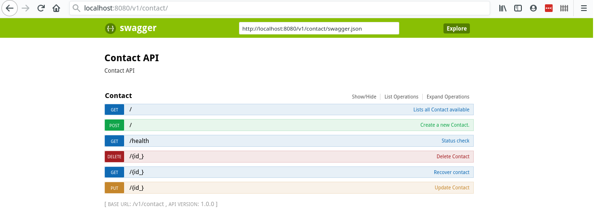

# NovaAPI

NovaAPI is a python package to accelerate REST API development.

## Status


## Getting Started

To install NovaAPI and its dependencies, you can use `pip` as follows:

```
pip install NovaAPI
```

If you are interested in developing the package itself, scroll down to [Installing for Development](#installing-for-development)

### First example

As our first example, we'll create a contact API which could be used to create an address book.
We need to create two files: [Contact.py](examples/Contact/Contact.py) and [ContactDAO.py](examples/Contact/ContactDAO.py), shown below.

##### Contact.py

In this file, we describe our entity, that is, our contact. We include all information we want to add to the database. Beside our custom defined fields, as it inherits from [Entity](nova_api/entity.py) we also have an UUID, the creation datetime and the last modified datetime automatically generated.

In this example, we use the "type" key in the metadata to gain control over how our data is going to be stored in the database. As our attributes are strings, they would be `VARCHAR(100)` if no type was informed.

```python
from dataclasses import dataclass, field

from nova_api.entity import Entity

@dataclass
class Contact(Entity):
    first_name: str = field(default=None, metadata={"type":"VARCHAR(45)"})
    last_name: str = ''
    telephone_number: str = field(default=None, metadata={"type":"VARCHAR(15)"})
    email: str = field(default=None, metadata={"type":"VARCHAR(255)"})
```

##### ContactDAO.py

In out ContactDAO, we only need to inherit from GenericSQLDAO and assign our return_class in the init method

```python
from nova_api.dao.generic_sql_dao import GenericSQLDAO

from Contact import Contact


class ContactDAO(GenericSQLDAO):
    def __init__(self, database_type=None, **kwargs):
        super(ContactDAO, self).__init__(database_type=database_type,
                                         return_class=Contact, **kwargs)
```

#### Starting a server for this example locally

If we want to run this example through a local flask server, we can use the following [server.py](examples/Contact/server.py) file. It will generate the api files and start the server at port 8080. You also need a database running at localhost with a root user with password root.

##### server.py
```python
import connexion
from flask_cors import CORS
from os import environ
from nova_api import create_api_files


debug = False
port = 8080
entity = "Contact"
dao_class = entity + 'DAO'
version = "1"

# Import entity and dao
mod = __import__(dao_class, fromlist=[dao_class])
entity_dao = getattr(mod, dao_class)
mod = __import__(entity, fromlist=[entity])
entity_class = getattr(mod, entity)

# Generate api documentation and implementation
create_api_files(entity_class, entity_dao, version)

# Create the table in the database
dao = entity_dao()
dao.create_table_if_not_exists()

# Create the application instance
app = connexion.App(__name__, specification_dir=".")
CORS(app.app)

# Add the api to the flask server
app.add_api(entity.lower() + "_api.yml")
print("Done adding api for {ent}".format(ent=entity))

if __name__ == '__main__':
    app.run(debug=debug, port=port)
```

After creating the server.py file, we can start it with the following command:

```
$ python server.py
...
Done adding api for Contact
 * Serving Flask app "server" (lazy loading)
 * Environment: production
   WARNING: This is a development server. Do not use it in a production deployment.
   Use a production WSGI server instead.
 * Debug mode: off
 * Running on http://0.0.0.0:8080/ (Press CTRL+C to quit)
```

Next, we can navigate to localhost:8080/v1/contact/ui to see the live swagger documentation as shown below:



And you're all set to start using your contact api!


### Installing for Development

If you want to contribute, clone this repo and navigate to its folder, it can be done with the following command:

```
git clone https://github.com/novaweb-mobi/nova-api && cd nova-api
```

Next, install the dependencies with pip:
```
pip install -r requirements.txt
```

And you're all set! You can move on to testing with the analyze script available at [analyze](analyze). To execute it on Linux, just run:

```
$ chmod u+x analyze && ./analyze
```

## Automatic Tests

The unit tests are available at [tests](tests). Before running them, you must have `pytest`, `pytest-mock` and `pytest-order` installed.

### Executing tests

The best way to run the test is with the analyze script available at the root of the project.
To run them, execute the following commands:

```
pip install -r requirements.txt
chmod u+x analyze
./analyze
```

## Deploy

When deploying to production, you should always use a production grade server(that's not flask) like uWSGI or NGINX. If you use Kubernetes or docker in your production environment, you can use our docker image available at this [repo](https://github.com/novaweb-mobi/connexion-api-docker/packages).

You can create your Dockerfile as the following example, with sets up an API for User:

```Dockerfile
FROM docker.pkg.github.com/novaweb-mobi/connexion-api-docker/novaapi:0.1.0
COPY User.py .
COPY UserDAO.py .
ENV PORT 8080
ENV ENTITIES User
ENV DB_URL 172.18.0.2
ENV DB_USER root
ENV DB_PASSWORD root
ENV DB_NAME default

```

## Contributing

Please read [CONTRIBUTING.md](CONTRIBUTING.md) for details on our code of
conduct and our PR submission policy.

## Versioning

We use [SemVer](http://semver.org/) for versioning. For available versions, check thr [tags on this repo](tags). 

## Authors

* **Fábio Trevizolo** - *Initial Work* - [FabioTS](https://github.com/FabioTS)
* **Mateus Berardo** - *Initial Work* - [MatTerra](https://github.com/MatTerra)

Also check the list of [contributors](contributors).

## License

This project is licensed under a MIT license - check the [LICENSE](LICENSE) file for details.

## Acknowledgments

* Thanks to [Billie Thompson/PurpleBooth](https://github.com/PurpleBooth) for this README template.
